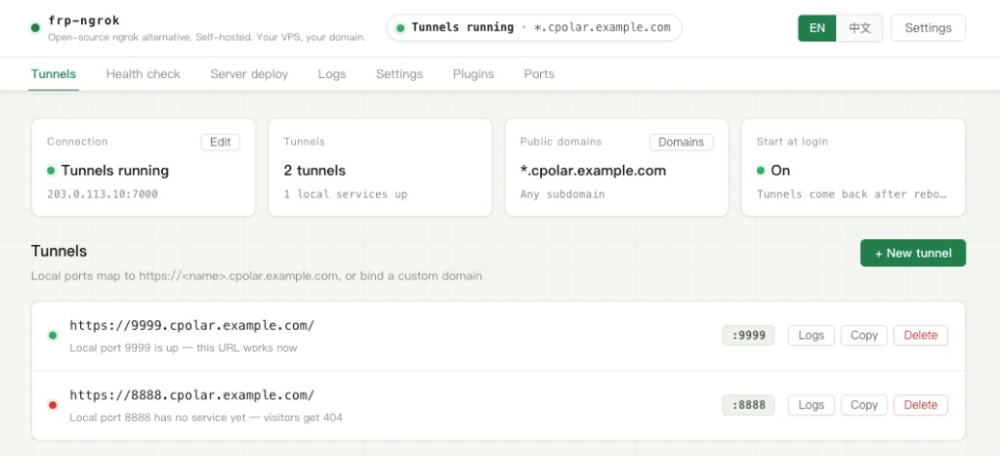
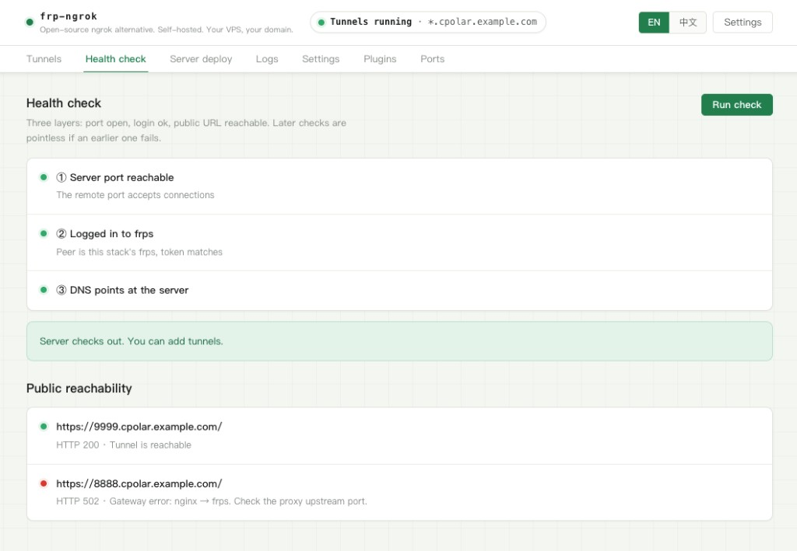
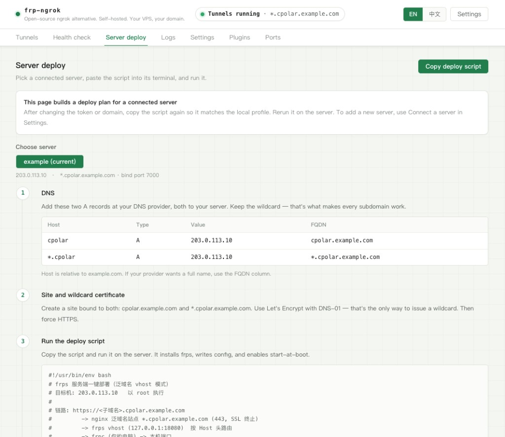
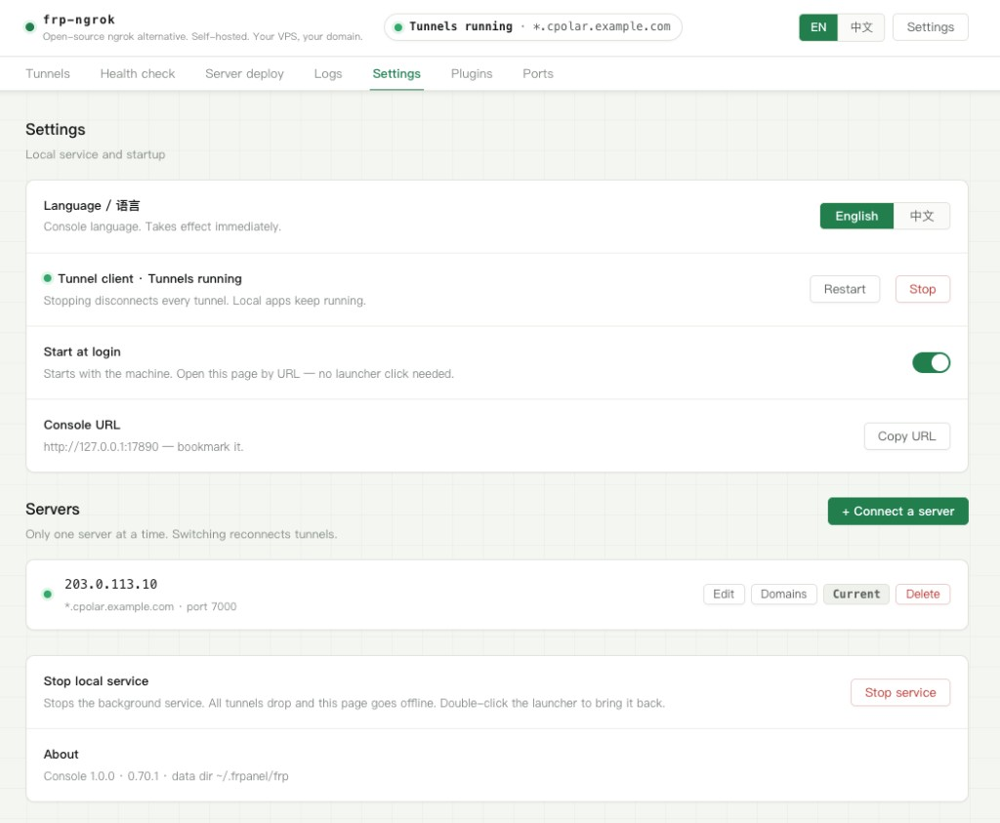

# frp-ngrok

**Open-source ngrok alternative. Self-hosted. Your VPS, your domain.**

GitHub: [github.com/openfrees/frp-ngrok](https://github.com/openfrees/frp-ngrok)

中文文档 / Gitee：[README.zh-CN.md](README.zh-CN.md) · [gitee.com/openfrees/frp-ngrok](https://gitee.com/openfrees/frp-ngrok)

Map a local port onto a hostname you own:

```
localhost:3000  ──►  https://api.your-domain.com
```

The server is yours. The domain is yours. No account, no relay network,
no usage meter. Everything lives on machines you control.



---

## What it is

A single binary that installs itself, stays resident, and serves a console
only your machine can open.

```
Double-click the app
    │
    ├─ first run → install to ~/.frp-ngrok/ and enable login item
    └─ later     → make sure the service is running
    │
    ├─ open http://127.0.0.1:17890
    └─ leave a status light in the menu bar
                    │
background service (kept alive by the OS)
    ├─ console HTTP API
    └─ supervise frpc  ← the tunnels live here
```

The browser and the menu bar are remotes. **Close the tab, quit the icon,
close the terminal — tunnels keep running.** They stop only when you choose
“Stop local service” in the console.

## Highlights

- **One executable** — UI, icons, and logic are embedded. No Node, Python, or Docker.
- **Menu bar status light** — green / yellow / red / grey.
- **Self-healing** — the OS keeps the service up; the service keeps frpc up.
- **Three-layer health check** — port open, login ok, public URL reachable.
- **Loopback only** — listens on `127.0.0.1`, plus an access token and Host check.

## Menu bar

After the first launch, a ring sits in the menu bar. Click it:

```
● Tunnels running · 2
203.0.113.10 · *.cpolar.example.com
─────────────────────────
Open console
─────────────────────────
●  9999  →  9999.cpolar.example.com
○  8888  →  8888.cpolar.example.com
─────────────────────────
Stop tunnels
Reconnect
─────────────────────────
Language / 语言
Plugins
─────────────────────────
Quit menu bar icon
```

A filled circle means that local port has a service. An empty circle means
nothing is listening yet. Click a tunnel row to open its public URL.

“Quit menu bar icon” only hides the icon. **Tunnels keep running.** Double-click
the app again to bring the icon back.

## Language

The console defaults to **English**. Open **Settings → Language / 语言** to
switch to Chinese. The choice is stored in `~/.frp-ngrok/prefs.json` and
survives restarts.

## Screenshots







Chinese shots: [README.zh-CN.md](README.zh-CN.md). Capture notes:
[docs/screenshots/](docs/screenshots/README.md).

## Install

### macOS

Download `frp-ngrok-macOS-*.zip`, drag `frp-ngrok.app` into Applications, double-click.

The build is not Apple-signed. First launch: right-click → Open → Open.
Or clear quarantine once:

```bash
xattr -dr com.apple.quarantine /Applications/frp-ngrok.app
```

Universal binary: Intel and Apple Silicon.

### From source

Go 1.25.8 (see `go.mod`). macOS also needs
Xcode Command Line Tools for the native menu bar:

```bash
git clone https://github.com/openfrees/frp-ngrok.git
cd frp-ngrok
make install     # build + install + open the console
make mac         # .app only
make package     # all platforms into ./dist
```

```bash
make install
# writes ./frp-ngrok then ~/.frp-ngrok/bin/frp-ngrok
```

Foreground debug without installing:

```bash
make dev
```

## Use it

You need:

- a VPS with a public IP (the cheapest size is enough)
- a domain whose DNS you can edit

### Domain modes

| Mode | You enter | DNS | Certificate | Tunnels on this server |
|---|---|---|---|---|
| Single host | full name + local port, e.g. `www.example.com → 3000` | one A record | ordinary cert, HTTP-01 is fine | the first tunnel is created at onboard |
| Wildcard | suffix `tunnel.example.com` (no `*.`) | `tunnel` and `*.tunnel` | wildcard, DNS-01 only | as many as you want |

The **base domain** is one per server (`frps.subDomainHost` is a single value).
Each tunnel can also bind its own **independent domain**. Independent names
cannot sit *under* the wildcard base — use a subdomain label instead of
`api.tunnel.example.com` if the base is already `tunnel.example.com`.

### Wizard

First open walks through DNS, a Let's Encrypt cert, and a generated deploy
script. The connection token is created for you and written into the script.

After that: **Tunnels** to add mappings, **Server deploy** to copy the script
again, **Settings** to add another server.

## Everyday actions

| Want | Do |
|---|---|
| Open the console | menu bar → Open console, or `http://127.0.0.1:17890` |
| See if it is up | glance at the menu bar light |
| Debug a dead tunnel | Health check (three layers) |
| Refresh the server script | Server deploy → copy script |
| Stop all tunnels | menu bar → Stop tunnels |
| Stop the local service | Settings → stop local service |
| Switch language | Settings → Language / 语言 |

```bash
frp-ngrok            # open console and stay in the menu bar
frp-ngrok tray       # menu bar only
frp-ngrok status     # print status
frp-ngrok uninstall  # remove service + binary, keep tunnel config
```

## Where files live

| Path | What |
|---|---|
| `~/.frp-ngrok/frp/profiles/<name>/` | server profile, tunnels, logs |
| `~/.frp-ngrok/frp/frpc` | bundled frpc |
| `~/.frp-ngrok/frp/server/` | exported deploy scripts |
| `~/.frp-ngrok/bin/frp-ngrok` | this program |
| `~/.frp-ngrok/token` | console access token |
| `~/.frp-ngrok/prefs.json` | UI language and other prefs |
| `~/Library/LaunchAgents/com.frpngrok.daemon.plist` | login item |

If `~/.frpanel/` already exists from an older build, that directory is still
used so your tunnels are not orphaned. New installs use `~/.frp-ngrok/`.

Uninstall does not delete `frp/` profiles.

## Security

The console can change config and spawn processes, so:

1. Bind **127.0.0.1** only
2. **Access token** on every API, file mode `600`
3. **Host header** check against DNS rebinding

`meta.conf`, `frpc.toml`, `token`, and deploy scripts are mode `600`.

## Platforms

| Platform | Status |
|---|---|
| macOS (Intel / Apple Silicon) | full: launchd + menu bar |
| Windows | builds; login item and tray not done yet |
| Linux | builds; systemd user unit not done yet |

## License

Apache License 2.0. Copyright 2026 The frp-ngrok Authors.
See [LICENSE](LICENSE) and [NOTICE](NOTICE).

This project is **not** affiliated with ngrok, Inc., Cloudflare, Inc., or cpolar.
Those names are trademarks of their owners. The tunnel engine is
[fatedier/frp](https://github.com/fatedier/frp) (also Apache 2.0).
