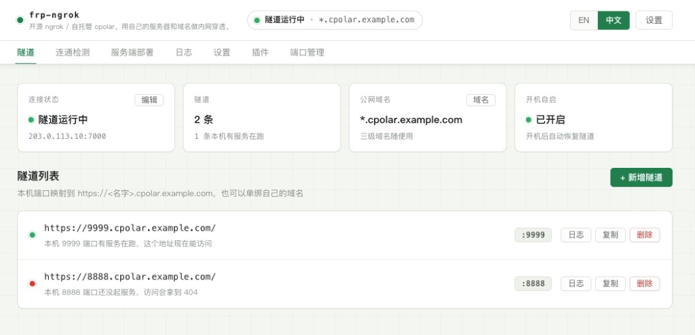
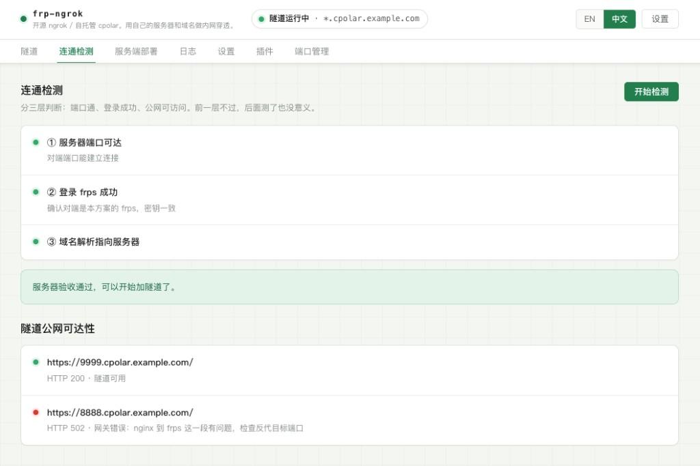
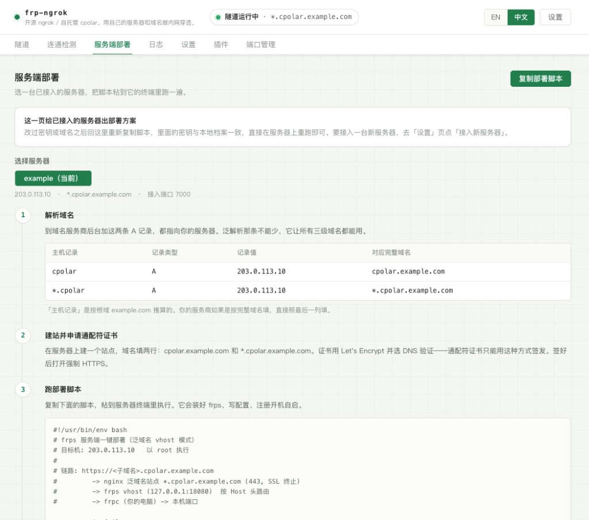
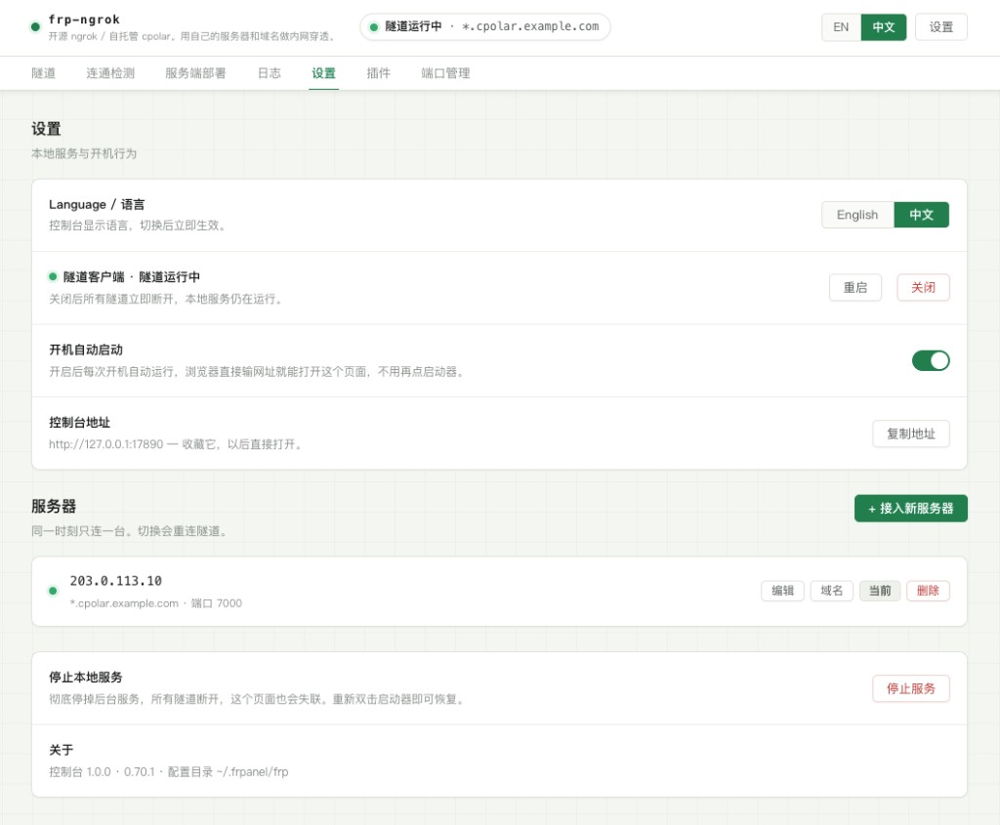

# frp-ngrok

开源 ngrok / 自托管 cpolar。用自己的服务器和域名做内网穿透。

Gitee：[gitee.com/openfrees/frp-ngrok](https://gitee.com/openfrees/frp-ngrok)

English / GitHub：[README.md](README.md) · [github.com/openfrees/frp-ngrok](https://github.com/openfrees/frp-ngrok)

把本机端口映射到你自己的域名上：

```
本机 :3000  ──►  https://api.你的域名.com
```

服务端用你自己的服务器，域名用你自己的域名。没有账号体系，没有中转节点，
所有配置都在你自己的机器上。



---

## 它是什么

一个单文件程序，装好后在后台常驻，提供一个只有本机能访问的网页控制台。

```
双击应用
    │
    ├─ 没装过 → 自动装到 ~/.frp-ngrok/ 并注册开机自启
    └─ 装过了 → 确认服务在跑
    │
    ├─ 打开浏览器 http://127.0.0.1:17890
    └─ 在菜单栏留下状态灯，随时点开
                    │
后台服务（系统保活）  │
    ├─ 提供控制台网页与接口
    └─ 监管 frpc 进程 ← 隧道在这里
```

浏览器和菜单栏都只是遥控器。**关掉网页、退出菜单栏图标、关掉终端，隧道都照常运行**，
只有在控制台里主动「停止本地服务」才会断开。

## 语言

控制台默认英文。打开 **Settings → Language / 语言** 可切到中文，选择会写进本机 `~/.frp-ngrok/prefs.json`，下次启动仍生效。

## 截图







英文界面见 [README.md](README.md)。拍摄说明见 [docs/screenshots/](docs/screenshots/README.md)。

## 特点

- **单个可执行文件** — 网页、图标、逻辑全部内嵌，没有运行时依赖
- **不需要装 Node / Python / Docker** — 下载即用
- **菜单栏状态灯** — 绿色运行、黄色连接中、红色异常、灰色停止，一眼看清
- **进程自愈** — 服务由系统保活，frpc 由服务保活，异常退出秒级重连
- **三层连通检测** — 分清「端口通」「登录成功」「公网可访问」，不含糊报绿灯
- **只监听 127.0.0.1** — 配合访问令牌与 Host 校验，外网碰不到
## 菜单栏

双击应用后，屏幕右上角菜单栏会出现一个环形状态灯，点开是：

```
● 隧道运行中 · 2 条
203.0.113.10 · *.cpolar.example.com
─────────────────────────
打开控制台
─────────────────────────
●  9999  →  9999.cpolar.example.com
○  8888  →  8888.cpolar.example.com
─────────────────────────
停止隧道
重新连接
─────────────────────────
Language / 语言
插件
─────────────────────────
退出菜单栏图标
```

点隧道那一行会直接在浏览器打开对应公网地址。行首的实心圆表示本机端口有服务在跑，
空心圆表示端口上暂时没东西。

「退出菜单栏图标」只是收起图标，**隧道不受影响**，再双击一次应用就回来了。

## 安装

### macOS

下载 `frp-ngrok-macOS-*.zip`，解压后把 `frp-ngrok.app` 拖进「应用程序」，双击。

首次打开若提示「无法验证开发者」，是因为这个包没有花钱买苹果开发者签名。
在应用图标上**右键 → 打开**，再点一次「打开」即可，只需一次。

或者用命令行去掉隔离标记：

```bash
xattr -dr com.apple.quarantine /Applications/frp-ngrok.app
```

安装包是通用二进制，Intel 和 Apple Silicon 都能跑，不用区分下载。

### 从源码构建

需要 Go 1.25.8（以 `go.mod` 为准）。macOS 还需要 Xcode Command Line Tools，
因为菜单栏用到了系统原生界面接口：

```bash
git clone https://gitee.com/openfrees/frp-ngrok.git
cd frp-ngrok
make install     # 构建 + 安装 + 打开控制台
make mac         # 只打 .app 应用包
make package     # 打全平台产物
```

### 开发后怎么测试和打包

改完代码后，最常用的是直接把当前项目编译并安装成本机正在用的版本：

```bash
cd frp-ngrok
make install
```

这条命令会先在项目根目录生成 `./frp-ngrok`，再安装到：

```bash
~/.frp-ngrok/bin/frp-ngrok
```

并打开控制台。如果后台服务已经在跑，安装逻辑会让服务换上新版。

想看它等价的手动步骤，可以拆成：

```bash
cd frp-ngrok
CGO_ENABLED=1 go build -trimpath -o frp-ngrok .
./frp-ngrok install
./frp-ngrok open
```

只想前台调试、不安装到 `~/.frp-ngrok/bin/frp-ngrok`：

```bash
make dev
```

打 macOS 应用包：

```bash
make mac
```

打全平台产物：

```bash
make package
```

打包结果都在项目根目录的 `dist/` 下。

## 使用

### 一、准备服务器和域名

你需要：

- 一台有公网 IP 的服务器（最低配就够，穿透几乎不吃 CPU）
- 一个你自己的域名，能改 DNS 解析

### 二、选域名模式

先决定这台服务器怎么对外，后面的解析、证书、frps 配置全由它决定：

| 模式 | 域名怎么填 | 解析 | 证书 | 挂在它下面能开几条隧道 |
|---|---|---|---|---|
| 单域名 | 完整域名和本机端口，例如 `www.example.com → 3000` | 一条 A 记录 | 普通证书，HTTP 验证即可 | 接入时直接创建一条 |
| 泛域名 | 填后缀 `cpolar.example.com`（不带 `*.`） | 两条：`cpolar` 和 `*.cpolar` | 通配符证书，只能 DNS 验证 | 任意多条 |

泛域名要求 `*.cpolar.example.com` 和 `cpolar.example.com` 成对配好；直接拿根域做后缀也行，那就是 `*.example.com` 配 `example.com`。

这个模式只决定**档案域名**（下文叫「底座」）怎么用。除它之外，每条隧道还可以单绑一个自己的独立域名（例如 `www.other.com`），
两种方式在同一台服务器上并存——单域名模式下也能靠它同时开多条隧道。代价是独立域名的解析、证书和
nginx 站点都要你自己配一遍，而且它不能落在泛域名底座下面：`api.cpolar.example.com` 这种地址 frps 不收，
直接用三级域名 `api` 就行，效果一样。

底座是**一台服务器一个**，因为 frps 的 `subDomainHost` 只有一个值。不想要它了也可以不要：
这时所有隧道各绑各的独立域名，控制台显示「未设底座」。

### 三、跟着接入向导走

控制台第一次打开会引导你完成三件事：

1. **解析域名** — 按上面的模式加 A 记录，指向你的服务器
2. **申请证书** — 建站绑定域名并签发 Let's Encrypt 证书
3. **跑部署脚本** — 控制台生成好的脚本，复制到服务器终端执行

选择单域名时，第一步会同时要求本机端口，服务器档案与 `域名 → 本机端口` 的首条隧道一次创建；选择泛域名时暂不要求端口，部署完成后再按三级域名逐条添加。具体要加哪几条记录、绑哪几行域名，向导第二步会按你选的模式列出来。连接密钥自动生成并写进脚本，不用你填也不用记。

「服务端部署」页只服务**已经接入的服务器**：选一台，就能看到它完整的解析记录、证书要求和部署脚本。脚本里的密钥直接取自本地档案，所以改过密钥或域名之后，回这一页重新复制、在服务器上重跑一遍就行。

新建服务器一律走「设置」页的「接入新服务器」——只此一个入口。要改已接入的服务器，用「隧道」页概览里「连接状态」卡片的「编辑」（改 IP、端口、密钥）和「公网域名」卡片的「域名」（看全部对外域名，顺便删掉空着的泛域名底座），或「设置」页服务器列表里的两颗按钮，两处的「域名」打开的是同一个弹窗。

域名分两类，性质相反：

**底座**一台服务器只有一个（frps 的 `subDomainHost` 只能填一个值），是单域名与泛域名二选一。它的生命周期是这样的：

| 想做什么 | 在哪做 | 附带影响 |
|---|---|---|
| 建第一个 | 接入向导第一步 | — |
| 删掉泛域名底座 | 「公网域名」弹窗，底座那一行的「删除」；**底下还挂着隧道时这颗按钮不出现** | 要重跑一次部署脚本，把服务端的 `subDomainHost` 去掉 |
| 收回单域名底座 | 不用手动——它只挂得下一条隧道，那条删掉时自动收回 | 服务端不用动，单域名模式本来就没写 `subDomainHost` |
| 从单域名建立泛域名底座 | 「新增隧道」里选「泛域名（新建底座）」，填三级域名和底座域名 | 原单域名隧道自动改为独立域名并保留；另需两条 A 记录、一张通配符证书、nginx 站点和重跑部署脚本 |

**独立域名**可以有若干个，跟着各自的隧道走，在「新增隧道」里选「独立域名」就是绑定、删掉那条隧道就是解绑，别处改不了也不用改。

改底座为什么非要重跑脚本：三级域名是服务端拿 `subDomainHost` 拼出来的。脚本没重跑，frps 认的还是旧底座，
面板上显示的地址与实际生效的地址就会对不上，而两边日志都只会说「proxy 启动成功」。

### 四、加隧道

在「隧道」页点新增填本机端口，然后选这条隧道的公网地址怎么来。弹窗顶上会先把当前底座摆出来，
好让你知道填的三级域名会拼到哪儿去：

- **泛域名下的三级域名** — 起个名字就行，解析和证书都是现成的
- **独立域名** — 填一个完整域名，弹窗会列出你要在服务器上补的三件事：A 记录、证书、nginx 站点反代到 `127.0.0.1:18080`（记得保留 `proxy_set_header Host $host`）
- **泛域名（新建底座）** — 在这台服务器还没有泛域名底座时出现。现有单域名已经挂了隧道也没关系，它会自动变成独立域名隧道，原地址与本机端口都保留。两格并排填 `api` 和 `cpolar.example.com`，
  这条隧道就是 `https://api.cpolar.example.com`，底座顺带建成 `*.cpolar.example.com`。
  弹窗会列出服务器那边要补的四件事，最后一件是重跑部署脚本，别漏。

单域名模式下档案域名固定指向一个端口，要再开就给新隧道绑独立域名。

## 常用操作

| 想做什么 | 怎么做 |
|---|---|
| 打开控制台 | 点菜单栏图标 → 打开控制台，或访问 `http://127.0.0.1:17890` |
| 看隧道通没通 | 瞄一眼菜单栏状态灯 |
| 排查不通 | 「连通检测」页，三层依次给结论和修复建议 |
| 重新取部署脚本 | 「服务端部署」页选中那台服务器，点「复制部署脚本」 |
| 换个泛域名底座 | 先在「公网域名」弹窗删掉旧的（要求底下没有隧道），再从「新增隧道」建新的，最后重跑部署脚本 |
| 换服务器 | 「设置」页接入新服务器，顶栏下拉切换 |
| 关掉所有隧道 | 菜单栏 → 停止隧道，或「设置」页关闭客户端 |
| 彻底停服务 | 「设置」页停止本地服务 |
| 不要开机自启 | 「设置」页关掉开关，当前运行不受影响 |
| 换成中文界面 | 「设置」页最上面 Language / 语言 |

命令行也可以：

```bash
frp-ngrok            # 打开控制台并驻留菜单栏
frp-ngrok tray       # 只驻留菜单栏
frp-ngrok status     # 看状态
frp-ngrok uninstall  # 卸载（保留隧道配置）
```

## 服务端运维与排错

「服务端部署」页是服务端配置的唯一入口：它会按所选档案生成 frps 部署脚本和
完整 nginx 反代配置。换了接入端口、vhost 端口、密钥或泛域名底座后，应重新复制
并执行部署脚本；nginx 配置也要以该页当前显示的端口为准。

服务端常用命令：

```bash
systemctl status frps                    # 服务状态
systemctl restart frps                   # 修改 frps.toml 后重启
tail -f /www/frp/frps.log                # 服务端日志
ss -lntp | grep -E ":(7000|18080)\b"    # 按实际端口检查监听
```

接入端口（默认 `7000`）需要同时在服务器防火墙和云厂商安全组放行。vhost 端口
（默认 `18080`）应只监听 `127.0.0.1`，不要对公网开放；公网 HTTPS 统一经过
nginx，frps 再依据原始 `Host` 头选择隧道。完整反代配置已包含 WebSocket、
300 秒长任务、100MB 请求体和 SSE 不缓冲设置，可在部署页一键复制。

控制台的「连通检测」会优先做自动诊断。需要手工分段时，按真实端口和域名替换
下面的示例：

```bash
# 1. 本机执行：确认本地服务本身正常
curl -I http://127.0.0.1:3000/

# 2. 服务器执行：绕过 nginx，确认 frpc ↔ frps 与 Host 路由正常
curl -I -H "Host: api.example.com" http://127.0.0.1:18080/

# 3. 任意机器执行：确认 DNS、证书、nginx 和隧道的完整链路
curl -I https://api.example.com/
```

- 第 1 段通、第 2 段不通：检查 frpc/frps 日志、连接密钥和 vhost 配置。
- 第 2 段通、第 3 段不通：检查 DNS、证书、nginx 站点和反代配置。
- 返回 `502/503/504`：通常是 nginx 到 frps 的 vhost 端口不通。
- 返回 `404` 且本机服务正常：检查 nginx 是否透传 `Host`、隧道域名是否一致。
- 通配符证书只覆盖一层子域名；不要把多级名字当作三级域名使用。

服务端脚本中的连接密钥会写进 `/www/frp/frps.toml`，本地也会写进对应档案的
`frpc.toml`。需要轮换时，在控制台编辑连接信息，再重新执行该档案的部署脚本并
重新连接客户端，保证两端一致。

## 文件都放在哪

| 路径 | 内容 |
|---|---|
| `~/.frp-ngrok/frp/profiles/<名字>/` | 服务器信息、隧道配置、运行日志 |
| `~/.frp-ngrok/frp/frpc` | frp 客户端程序 |
| `~/.frp-ngrok/frp/server/` | 导出的服务端部署脚本 |
| `~/.frp-ngrok/bin/frp-ngrok` | 本程序 |
| `~/.frp-ngrok/token` | 控制台访问令牌 |
| `~/.frp-ngrok/prefs.json` | 界面语言等偏好 |
| `~/Library/LaunchAgents/com.frpngrok.daemon.plist` | 开机自启配置 |

卸载不会删除 `~/.frp-ngrok/frp/`，你的隧道配置一直在。

## 安全说明

控制台能改配置、能拉起进程，所以做了三道防护：

1. **只绑定 127.0.0.1** — 局域网和公网都访问不到
2. **访问令牌** — 所有接口都要带令牌，令牌只存在本机且仅当前用户可读
3. **Host 头校验** — 拒绝非本机域名的请求，挡住 DNS 重绑定攻击

含密钥的文件（`meta.conf`、`frpc.toml`、`token`、部署脚本）权限都是 `600`。

## 平台支持

| 平台 | 状态 |
|---|---|
| macOS (Intel / Apple Silicon) | 完整支持：launchd 托管 + 菜单栏状态灯 |
| Windows | 可编译运行，开机自启注册与托盘图标待适配 |
| Linux | 可编译运行，systemd user 服务待适配 |

交叉编译一条命令：

```bash
make package     # 一次产出全平台
```

## 当前限制

- Windows / Linux 能编译，开机自启和托盘还没做，见上表。
- 本机静态站和面板同进程，单个站点异常可能影响控制台。
- 站点文件弹窗只操作根目录；更大的文件请直接放进站点文件夹。
- 没有接入服务器时，主导航不露出「端口管理」。
- Markdown 预览会保留原文 HTML。站点只监听 `127.0.0.1`。

## 图标

应用图标与菜单栏图标都由 `cmd/genicon` 用几何构形程序化绘制，
不是位图缩放，所以从 16 像素到 1024 像素都锐利。改配色或造型改那份源码即可：

```bash
make icons
```

## 开源协议

Apache License 2.0。版权所有 2026 The frp-ngrok Authors。完整文本见 [LICENSE](LICENSE)，第三方致谢见 [NOTICE](NOTICE)。

本项目与 ngrok, Inc.、Cloudflare, Inc. 及 cpolar 无关联。「ngrok」「Cloudflare」「cpolar」是各自权利人的商标。底层隧道引擎是 [fatedier/frp](https://github.com/fatedier/frp)（同样为 Apache 2.0）。
